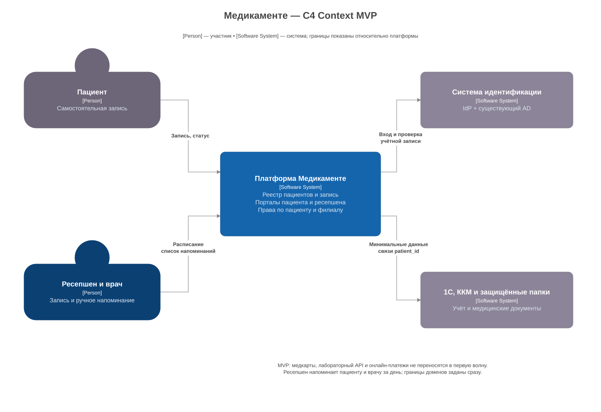
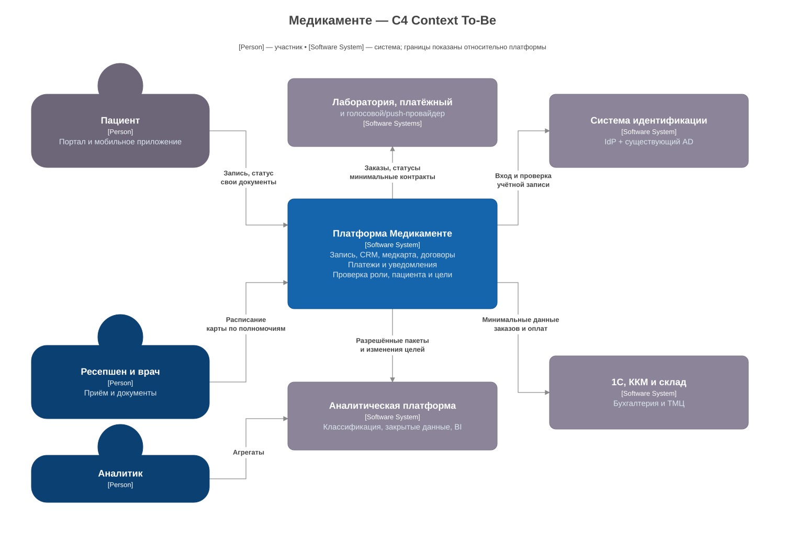

# Архитектура

Выбираю Java-приложение с модулями пациентов, записи и медкарт, PostgreSQL и закрытое хранилище документов. Небольшой команде проще сопровождать одно приложение и добавлять функции по мере миграции.

## MVP

[Контекст в draw.io](c4-context-mvp.drawio)

Через два месяца пациент записывается через портал, ресепшен видит запись и за день напоминает пациенту и врачу. Фоновая задача готовит список напоминаний. Медкарты пока остаются в защищённых папках, 1С и ККМ продолжают работать.

Пациенты входят через Keycloak, сотрудники — через связь с AD. Привязку аккаунта к старой карте подтверждает ресепшен после проверки личности. Занять один слот врача дважды нельзя.

## Целевое состояние

[Контекст в draw.io](c4-context-target.drawio)

за год добавляем мобильное приложение, документы пациента, лабораторный API, платёжный шлюз и аналитику. 1С остаётся источником бухгалтерского и складского учёта.

| блок | что делает для Privacy by Design |
|---|---|
| Keycloak + AD | вход, роли и MFA сотрудников |
| Clinic API | CRM, запись, медкарты; проверка роли, конкретного пациента и цели обработки |
| PostgreSQL и хранилище документов | разделение медицинских, контактных и платёжных данных; закрытый доступ по умолчанию |
| интеграции | только нужные поля для лаборатории, платежей и уведомлений |
| аудит и мониторинг | журнал доступа и алерты подозрительных действий |
| каталог и классификатор | теги, владелец, срок хранения, проверка пакетов перед аналитикой |

## Доступ

| данные | кто видит |
|---|---|
| контакты и запись | пациент, ресепшен, назначенный врач |
| медкарты и анализы | пациент и лечащий врач |
| договоры | пациент, ресепшен, уполномоченный бухгалтер |
| оплата | пациент, кассир, бухгалтер — без диагноза |
| кадры / склад | кадровая группа / склад и бухгалтерия |
| аналитика | аналитик — агрегаты; исследователь — согласованную выборку |

роль дополняем проверкой объекта при каждом запросе и скачивании. Пациент получает только свои данные, врач — данные по своему эпизоду лечения. Идентификатор пациента берём из серверной связи с аккаунтом.

## Интеграции и аналитика

Лаборатория получает ID заказа и образца, код исследования и нужные характеристики образца. Результат принимаем только для заказа этой лаборатории, связь с пациентом хранится у нас. Повторный ответ не создаёт второй анализ.

Платёжный провайдер принимает данные карты, у нас остаются ID и статус операции. ККМ и файловые 1С работают в локальном сегменте через адаптер.

Push и голосовое напоминание не содержат диагноз. Подтверждение или отмена из приложения либо голосового ответа меняет запись через API и отображается у ресепшена.

В аналитику данные проходят через классификацию и минимизацию. Конфиденциальные выборки храним в закрытом слое, для BI готовим агрегаты. Состав и доступ к ML/LLM-выборке согласовываем отдельно. Слои и C2 — в [Task6](../Task6/classification.md).

## Проверки

Перед выпуском проверяем доступ к чужой карте, новые поля, теги и отсутствие ПДн в логах. Ошибка блокирует выпуск, результат проверки поступает в мониторинг. Массовое чтение и повторные отказы доступа дают алерт ответственному за систему.

При прекращении обработки блокируем соответствующую цель и по связям между наборами находим копии. Удаляем их с учётом обязательных сроков хранения, действие фиксируем в аудите.

Данные и копии размещаем в РФ. При росте добавляем экземпляры API и обработчики загрузки, аналитику отделяем от основной БД. Роли, сроки и напоминания задаём конфигурацией. До расширения проверяем работу на объёме 5×; фактических замеров пока нет.
