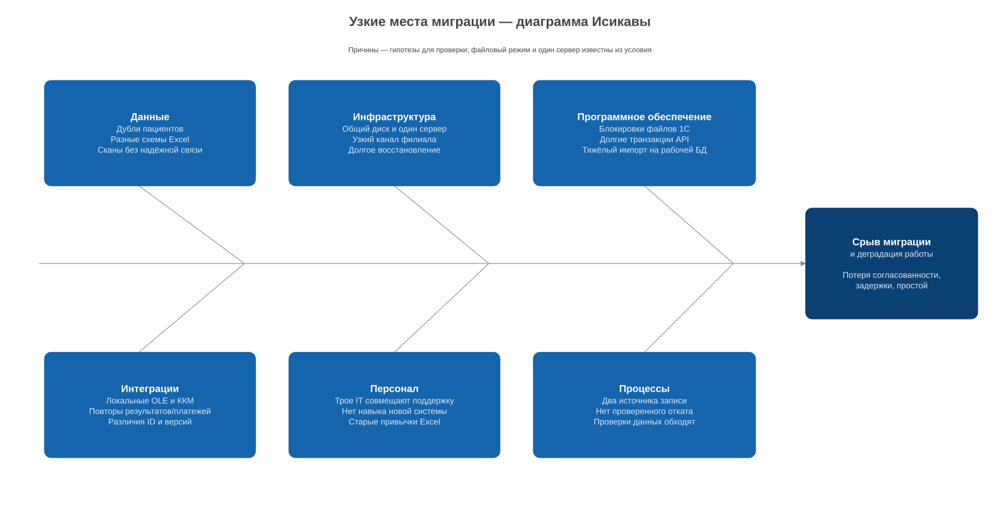

# Узкие места миграции

Главный риск — потерять связь между пациентом, записью, картой и платежом. Проверку качества данных и порядок записи нужно определить до ускорения переноса. 1С остаётся для учёта.

[Диаграмма Исикавы](ishikawa.drawio)

## Проблемы и решения

| категория | риск | проверка и мера | приоритет |
|---|---|---|---|
| данные | дубли, разные схемы Excel | пробный импорт, таблица соответствий, ручной разбор конфликтов | P1 |
| данные | повреждённые сканы, чужой patient_id | хеши, открытие файлов, сверка связи; спорные документы не публикуются | P1 |
| инфраструктура | копирование перегружает общий диск | замер I/O и задержек 1С, импорт согласованной копии вне пика | P1 |
| инфраструктура | медленный канал филиала, долгое восстановление | прогон реального объёма, начальная загрузка заранее, резерв времени | P1 |
| ПО | блокировки файлов и несогласованные Excel | снимок после завершения правок, короткая заморозка записи | P1 |
| ПО | API ждёт лабораторию в транзакции | тест с медленной зависимостью, outbox и worker | P2 |
| интеграции | локальные OLE/ККМ, повторы операций | стенд 1С, локальный адаптер, дедупликация по ID | P1 |
| персонал | IT совмещает поддержку и миграцию | распределить разработку, проверку и поддержку; для обмена привлечь специалиста 1С | P1 |
| персонал | сотрудники меняют старые файлы | обучение, пилот, read-only после переключения | P1 |
| процессы | два источника записи, непроверенный откат | один источник на процесс, репетиция cutover и обратного переноса | P1 |
| процессы | проверки обходят ради скорости | отрицательные тесты схем и доступа, карантин | P1 |

P1 — до пилота, P2 — в ходе миграции. Это риски по описанию, фактические объёмы, IOPS, RPS и число дублей пока не измерены.

## Порядок работ

1. Инвентаризация файлов и связей, восстановление копии, пробный импорт и сверка;
2. прогон объёма 5× с контролем времени загрузки и задержек API/1С;
3. репетиция переключения и отката, обучение ресепшена;
4. увеличение параллелизма после пилота, если у диска и БД остаётся запас.

Окно оценивается как `объём / измеренная скорость + классификация + сверка`. До переключения должен оставаться резерв времени.
