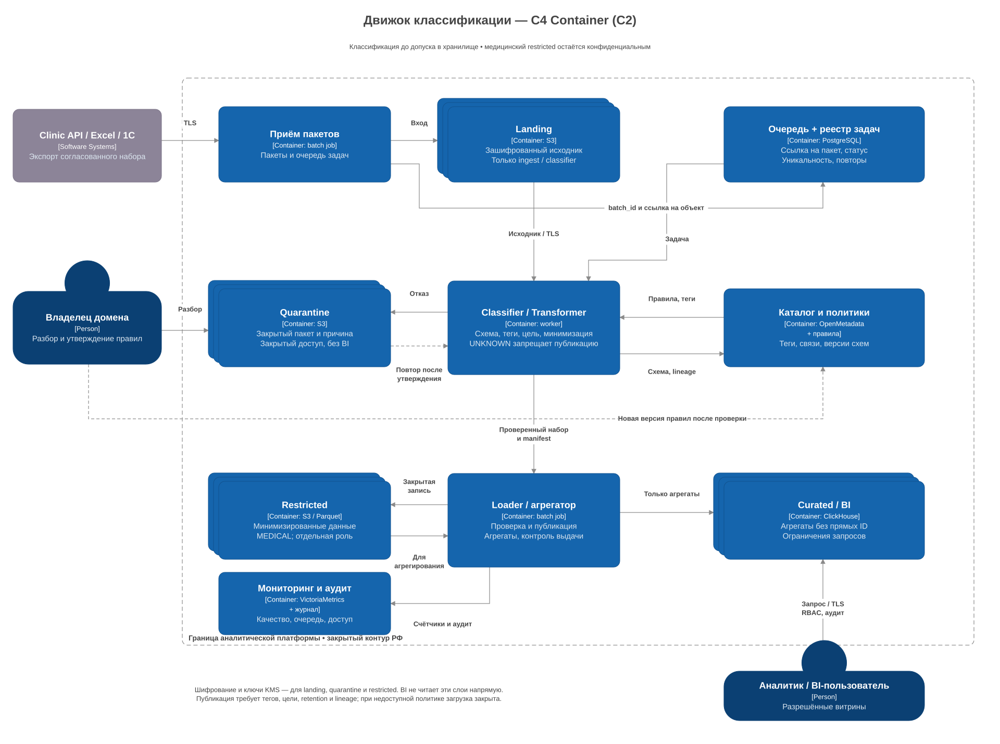

# Классификация данных

Перед загрузкой проверяем каждый пакет: входные файлы не размечены и могут менять структуру. Неизвестные поля отправляем в карантин, чтобы они не попали в аналитику без проверки.

[C2 в draw.io](c4-classifier.drawio)

## Как работает

1. Приёмщик сохраняет пакет в закрытый landing и ставит задачу в очередь;
2. классификатор сравнивает имена и типы полей с правилами, проверяет значения по словарям и шаблонам; для текста и сканов нужны распознавание сущностей и OCR;
3. новое поле, смена типа или неуверенное распознавание отправляют пакет в карантин;
4. владелец данных разбирает причину и утверждает правила, затем пакет проверяется повторно;
5. обработчик убирает лишние поля, заменяет patient_id псевдонимом и обобщает признаки;
6. загрузчик сохраняет результат в нужный слой и отмечает пакет как опубликованный. Повторная загрузка того же пакета не создаёт дубли.

Используем категории из [Task1](../Task1/README.md): `PUBLIC`, `INTERNAL`, `PERSONAL`, `MEDICAL`, `SECRET`, `UNKNOWN`. У поля может быть несколько тегов. Псевдонимизация сохраняет класс `MEDICAL`.

## Слои хранилища

| слой | что храним | доступ |
|---|---|---|
| landing | исходный пакет до обработки | приёмщик и классификатор |
| quarantine | пакет с неизвестной схемой или ошибками | классификатор и владелец данных |
| restricted | минимизированные конфиденциальные наборы | обработчики и исследователи по согласованной цели |
| curated | агрегаты по периоду и филиалу | BI-пользователи |

Данные шифруем, сроки хранения задаём по цели и типу набора. Исходные пакеты удаляем после подтверждённой обработки и окончания установленного срока. BI не получает доступ к landing, карантину и медицинским выборкам.

В агрегатах укрупняем малые группы и проверяем редкие признаки, по которым можно узнать пациента. Для ML/LLM отдельно согласуем состав выборки, основание, срок и доступ. Во внешние сервисы медицинские данные по умолчанию не передаём.

OpenMetadata хранит теги, владельцев и связи источник → набор → отчёт/модель. Правила версионируем, неизвестная схема блокирует публикацию. Это позволяет найти производные копии при исправлении или прекращении обработки.

## Метрики

| метрика | что показывает | как используем |
|---|---|---|
| recall: TP / (TP + FN) | доля найденных чувствительных полей | ищем пропуски и дополняем правила |
| precision: TP / (TP + FP) | доля верных срабатываний | уменьшаем лишний карантин |
| запрещённые поля на выходе | ошибки минимизации | останавливаем публикацию и разбираем причину |
| доля карантина, возраст пакетов | новые схемы и задержки разбора | назначаем владельца и обновляем правила |
| скорость загрузки, длина очереди | хватает ли обработчиков | меняем размер пакетов и параллелизм |

TP — верно найденные чувствительные поля, FN — пропущенные, FP — ошибочно отмеченные. Качество проверяем на вручную размеченной выборке по источникам и классам, включая новые схемы. Фактических значений пока нет.

## Масштабирование

Пакеты лежат в хранилище, очередь PostgreSQL содержит ссылки и статусы. Обработчики забирают разные задачи, число обработчиков увеличиваем при росте объёма. Идентификатор пакета и версия правил защищают от повторной публикации.

Для роста 5× проверяем скорость загрузки и нагрузку на диск и БД. Большие файлы делим на пакеты, тяжёлые задания запускаем вне пика. BI работает с витринами ClickHouse отдельно от основной БД клиники.
